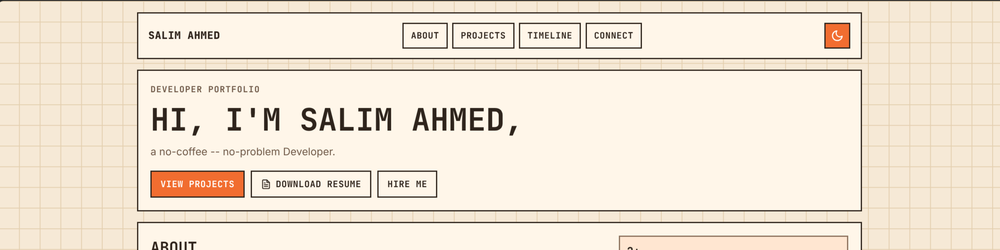

# Salim Ahmed — Portfolio (Astro)

Content-driven portfolio built with Astro.

## Stack

- Astro
- Astro Content Collections
- Markdown project entries (`src/content/projects/*.md`)

## Development

```bash
npm install
npm run dev
```

## Build

```bash
npm run build
npm run preview
```

## Content Workflow

To add a new project, create a new Markdown file in `src/content/projects/` with frontmatter that matches the schema in `src/content.config.ts`.

Example:

```md
---
title: Example Project
description: One clear sentence about the project.
image: /assets/images/example.png
imageAlt: Example project preview
technologies:
	- label: Python
		key: python
	- label: Git
	- label: GitHub
links:
	- label: Repository
		url: https://github.com/your/repo
order: 99
---
```

Projects are rendered automatically on the homepage.


